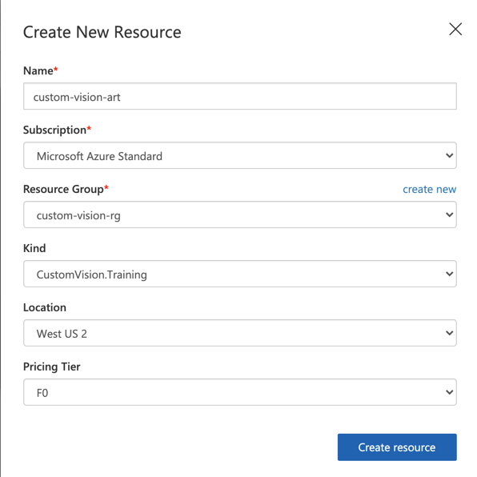
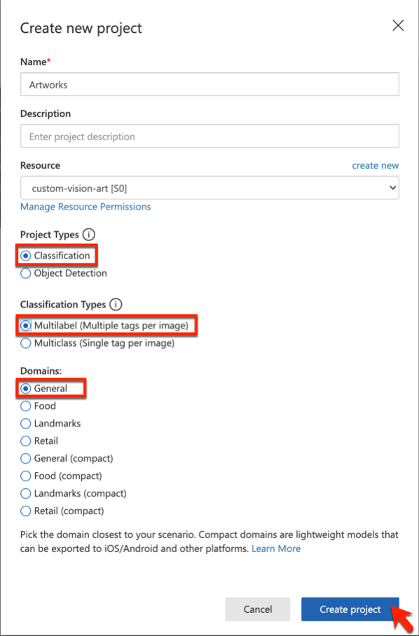

# Exercise - Create a Custom Vision Service

1. Open the [Custom Vision Service portal](https://www.customvision.ai/?azure-portal=true) in your browser. Then select **Sign In**.

1. If you are asked to sign in, do so using the credentials for your Microsoft account. If you are asked to let this app access your info, click **Yes**, and if prompted, agree to the terms of service.

1. Click **New Project** to create a new project.

    

1. In the **Create new project** dialog, name the project *Artworks*.
1. Select the Resource to use or create a new one by selecting create new. Fill in the following, using your own Name and Resource Group. If you do not have a resource group to use, you may create one.

    

    - Name: Create a new name for the resource.
    - Subscription: Choose your subscription.
    - Resource Group: Choose existing group or create one in a location near you.
    - Kind: Set to CognitiveServices. This will create a service that can do both training and prediction.
    - Location: Set the same as your resource group, preferably a location near you.
    - Pricing Tier: S0, which may incur some charges, so keep training to a minimum.

1. After you set the Resource, set the following options and choose **Create project:**
    - Project Types: Select **Classification**
    - Classification Types: Select **Multilabel**
    - Domains: Select **General**

    

    A domain optimizes a model for specific types of images. For example, if your goal is to classify food images by the types of food they contain or the ethnicity of the dishes, then it might be helpful to select the Food domain. For scenarios that don't match any of the offered domains, or if you are unsure of which domain to choose, select the General domain.

The next step is to upload images to the project and assign tags to those images to classify them.
