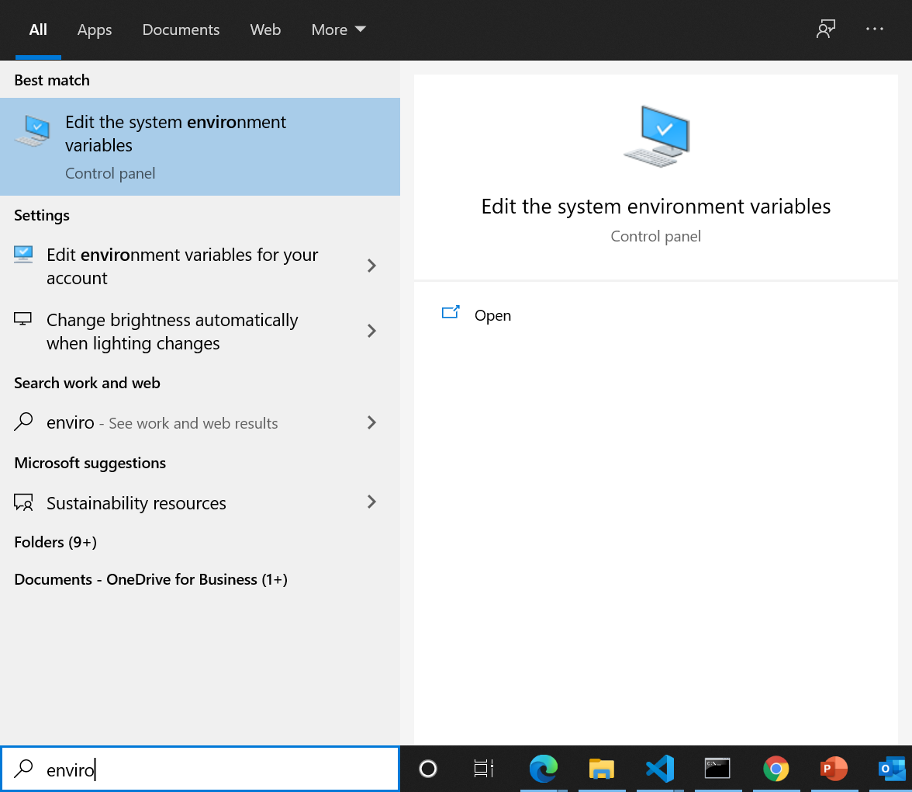
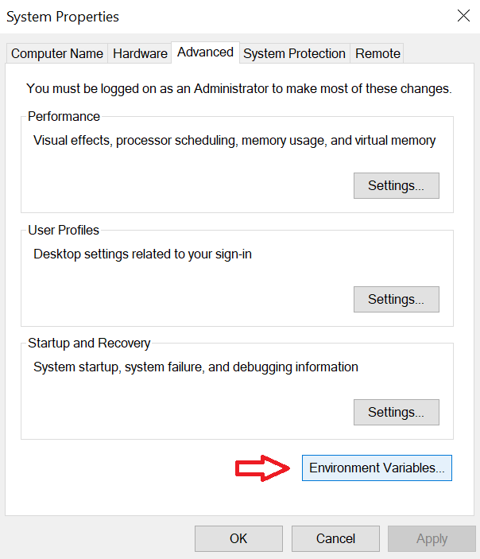
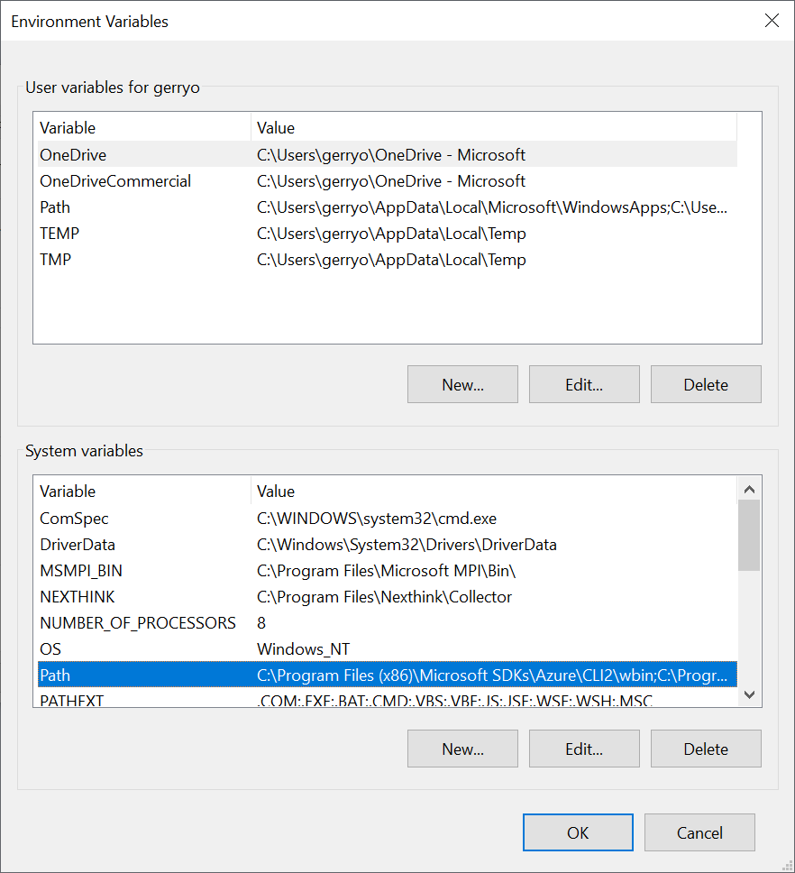
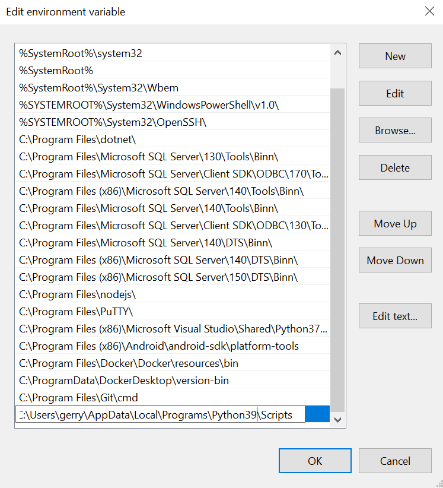

# Environment Setup

The environment for the exercises in this course, will make use of Visual Studio Code as the editor. Depending on the programming language you choose, the setup will differ. Follow the steps outlined here to configure your local computer for completion of the exercises.

1. Install [Visual Studio Code](https://code.visualstudio.com/) for your operating system.

### Python

If you will using Python as you preferred language, install the Python extension for VS Code from the Visual Studio Marketplace. For additional details on installing extensions, see [Extension Marketplace](https://code.visualstudio.com/docs/editor/extension-gallery). The Python extension is named Python and it's published by Microsoft.

#### Install a Python interpreter

Along with the Python extension, you need to install a Python interpreter. Which interpreter you use is dependent on your specific needs, but some guidance is provided below.

**Windows**

Install [Python from python.org](https://www.python.org/downloads/). You can typically use the Download Python button that appears first on the page to download the latest version.

>[!Note]
>If you don't have admin access, an additional option for installing Python on Windows is to use the Microsoft Store. The Microsoft Store provides installs of Python 3.7 and Python 3.8. Be aware that you might have compatibility issues with some packages using this method.

For additional information about using Python on Windows, see [Using Python on Windows at Python.org](https://docs.python.org/3.7/using/windows.html).

You will also require the **pip** utility to install packages. [Download pip](https://bootstrap.pypa.io/get-pip.py) to your local computer.  This is a Python file so you will use Python to install the packages. Open a command prompt, change to the directory where you stored the get-pip.py file, and run the following command to install pip on your Windows computer:

```bash
py -3 get-pip.py
```

Once **pip** is installed, you will need to add if to the path in Windows so you can run the command from anywhere, including a terminal window in VS Code.  To add pip to your path, follow these instructions:

1. Locate the **pip** install folder. This will typically be found in the C:\Users\<yourusernam>\AppData\Local\Programs\<Python>\Scripts. Copy this path to the clipboard.

>[!Note] Replace the <yourusername> placeholder with your own username on the computer you are using.  Replace the <Python? placeholder with your Python folder information. On this particular computer, that is Python39.  You can also use the Search option of Windows Explorer to locate the install of pip on your specific computer.
                                                                                                                            
1. In the Windows Seach bar, enter **environment** and then select **Edit the system environment variables** option.



1. In the **System Properties** window, select the **Environment Variables** button in the lower right corner.



1. Locate the **Path** option, under **System variables** in the bottom section of the **Environment Variables** dialog.



1. Select the **Path** option and then select the **Edit** button.
1. Select the **New** button.
1. Paste the copied path from above, into the new slot in the **Edit environment variable** dialog.



1. Select **OK** to close the Edit window, select **OK** to close the **Environment variable** window, and then select **OK** to close the **System Properties** dialog. 
1. Restart any command prompt or running instance of Visual Studio Code. Upon restart of these apps, the new path will take effect.


**macOS**

The system install of Python on macOS is not supported. Instead, an installation through Homebrew is recommended. To install Python using Homebrew on macOS use ```brew install python3``` at the **Terminal** prompt.

>![Note]
>On macOS, make sure the location of your VS Code installation is included in your PATH environment variable. See [these setup instructions](https://code.visualstudio.com/docs/setup/mac#_launching-from-the-command-line) for more information.

**Linux**

The built-in Python 3 installation on Linux works well, but to install other Python packages you must install pip with ```get-pip.py```.

**Other options**

Data Science: If your primary purpose for using Python is Data Science, then you might consider a download from Anaconda. Anaconda provides not just a Python interpreter, but many useful libraries and tools for data science.

Windows Subsystem for Linux: If you are working on Windows and want a Linux environment for working with Python, the Windows Subsystem for Linux (WSL) is an option for you. If you choose this option, you'll also want to install the Remote - WSL extension. For more information about using WSL with VS Code, see VS Code Remote Development or try the Working in WSL tutorial, which will walk you through setting up WSL, installing Python, and creating a Hello World application running in WSL.

#### Verify the Python installation

To verify that you've installed Python successfully on your machine, run one of the following commands (depending on your operating system):

Linux/macOS: open a Terminal Window and type the following command:

```python3 --version```

Windows: open a command prompt and run the following command:

```py -3 --version```

If the installation was successful, the output window should show the version of Python that you installed.

Note You can use the ```py -0``` command in the VS Code integrated terminal to view the versions of python installed on your machine. The default interpreter is identified by an asterisk (*).

### Select a Python interpreter

Python is an interpreted language, and in order to run Python code and get Python IntelliSense, you must tell VS Code which interpreter to use.

From within VS Code, select a Python 3 interpreter by opening the Command Palette (Ctrl+Shift+P), start typing the Python: Select Interpreter command to search, then select the command. You can also use the Select Python Environment option on the Status Bar if available (it may already show a selected interpreter, too):

The command presents a list of available interpreters that VS Code can find automatically, including virtual environments. If you don't see the desired interpreter, see Configuring Python environments.

>[!Note]
>When using an Anaconda distribution, the correct interpreter should have the suffix ('base':conda), for example Python 3.7.3 64-bit ('base':conda).

Selecting an interpreter sets the python.pythonPath value in your workspace settings to the path of the interpreter. To see the setting, select File > Preferences > Settings (Code > Preferences > Settings on macOS), then select the Workspace Settings tab.

>[!Note]
>If you select an interpreter without a workspace folder open, VS Code sets python.pythonPath in your user settings instead, which sets the default interpreter for VS Code in general. The user setting makes sure you always have a default interpreter for Python projects. The workspace settings lets you override the user setting.

### C#

1. If you will be using C# as your code language, start by installing the latest [.NET Core](https://docs.microsoft.com/dotnet/core/install/windows?tabs=netcore31) package for your platform. You can choose Windows, Linux, or macOS from the drop-down on this page.
1. Once you have .NET Core installed, you will need to add the C# Extension to VS Code. Select the **Extensions** option in the left nav pane, or press **CTRL+SHIFT+X** and enter C# in the search dialog.

With your environment setup, you are now ready to begin the coding exercise.
